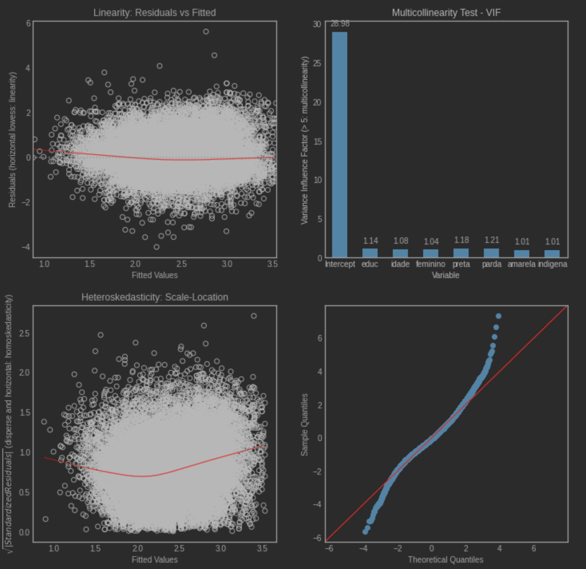
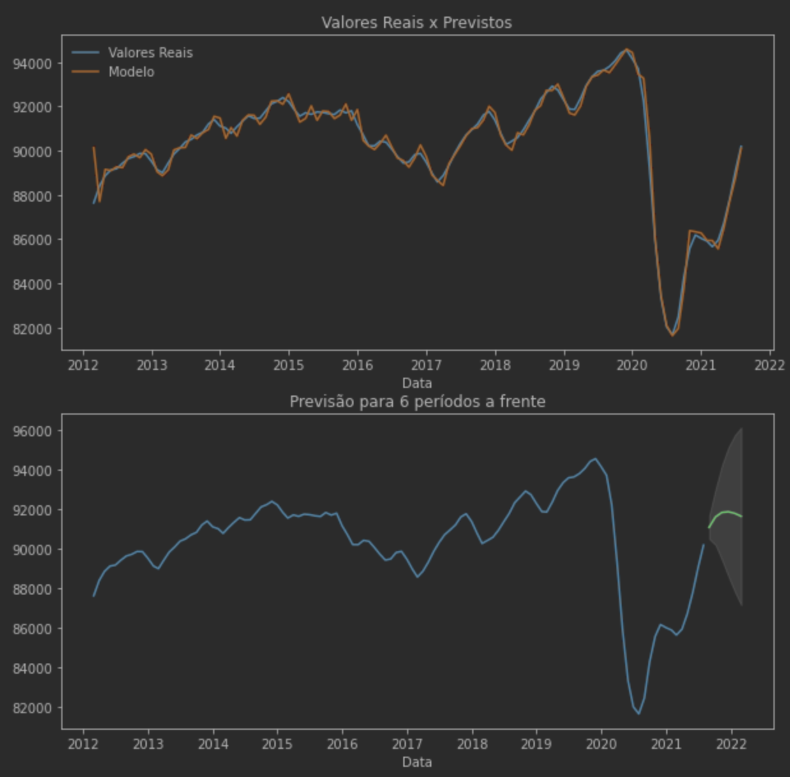
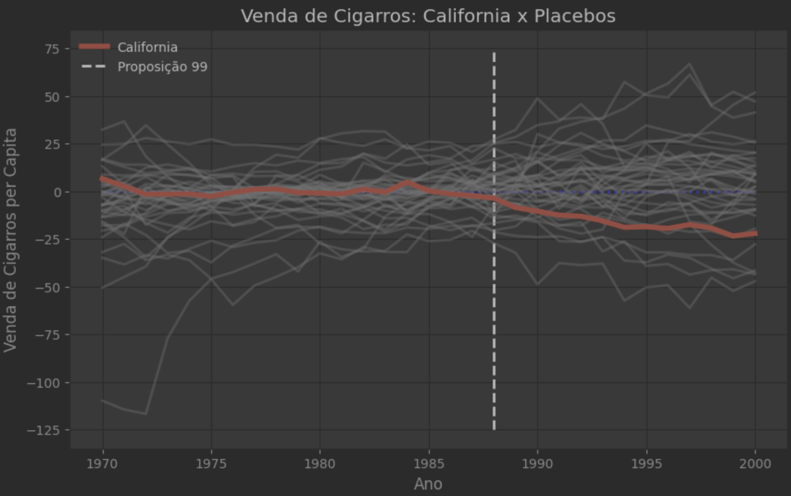
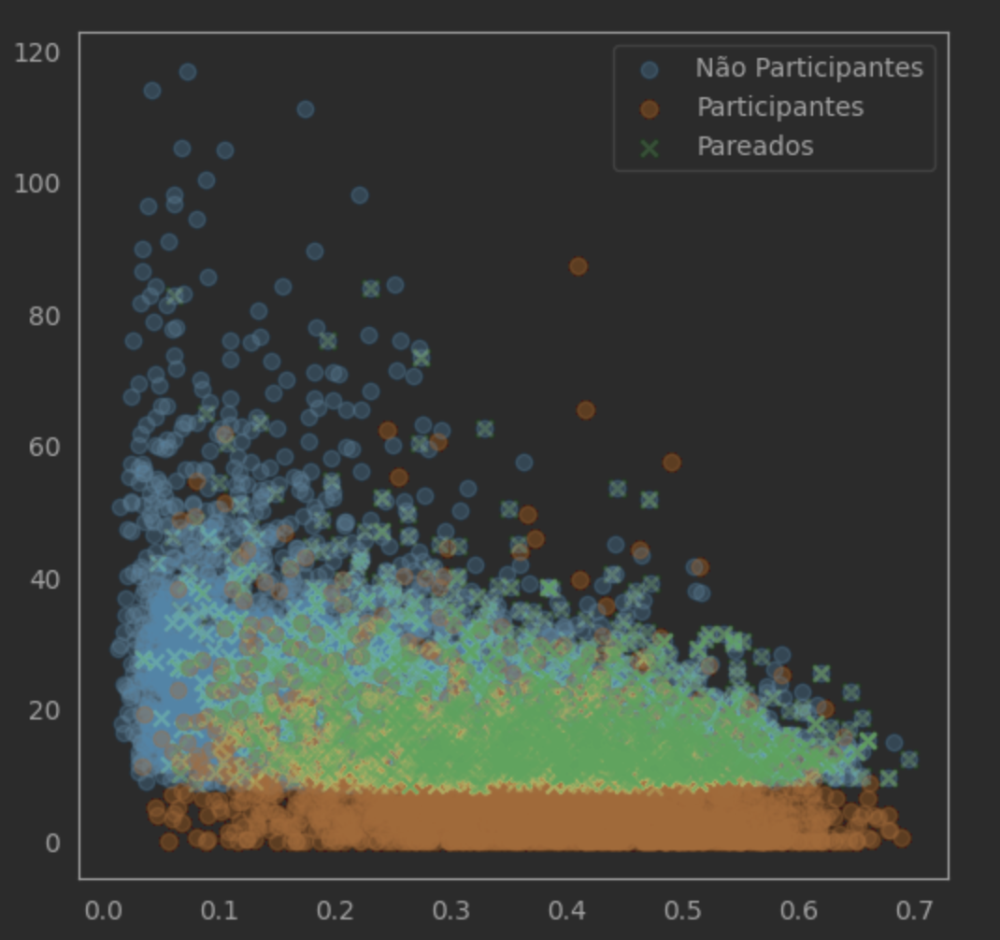
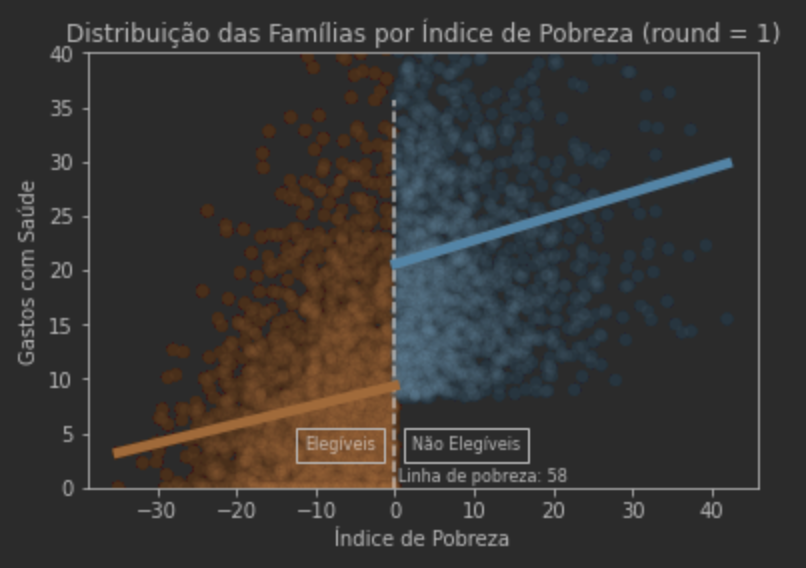

# Funções e Aplicações de Econometria

A intenção desse GitHub é unificar, simplificar e deixar claro as funções relativas à econometria no Python, usando principalmente o `statsmodels`, o `linearmodels` e o `scipy`.
Há uma série de exemplos na pasta *Notebooks*, contendo aplicações de regressões e testes, MQ2E, modelos de painel, séries temporais, avaliações de políticas públicas e modelos de crescimento econômico.

As funções estão reunidas no arquivo **`econometric_functions.py`**. Para usá-las, basta colocar o arquivo no mesmo diretório da sua aplicação e importar como um módulo normal:

```
import econometric_functions as ef
```

Caso queira deixar o arquivo em uma pasta separada, coloque o caminho da pasta abaixo e rode esse código:

```
import os
import sys

sCaminhoEconometria = "caminho_da_pasta"
sys.path.append(os.path.abspath(sCaminhoEconometria))

import econometric_functions as ef
```

As principais funcionalidades estão descritas abaixo:

----

## Regressões e Testes

- `ols_reg`: Executa uma regressão MQO a partir de uma formula, mas com opções mais fáceis para a matriz de covariância (robusta e clusterizada).
- `f_test`: Realiza um teste F de significância conjunta de várias variáveis. Consequentemente, é capaz de realizar um teste t de significância simples ou igualdade de coeficientes.
- `ols_diagnostics`: Talvez uma das maiores contribuições do diretório; é similar ao `plot(modelo)` do R, plottando gráficos e realizando testes que verificam todas as hipóteses do modelo linear clássico (Gauss-Markov).

Nesse sentido, `cooks_distance_outlier_influence` ajuda a averiguar a existência de outliers e observações com alta alavancagem, que poderiam ter muita influência sobre os coeficientes estimados para a regressão.

<p align="center">

</p>

----

## Modelos de Painel

- `xtdescribe_panel`: Similar ao comando do STATA, verifica o grau de balanceamento do painel, ou seja, conta a distribuição do número de aparecimentos dos indivíduos no *dataset*.
- `panel_structure`: Cria um DataFrame com um MultiIndex de indivíduo-tempo, necessário para os modelos de painel.

Há todos os modelos de painel presentes no livro *Introdução a Econometria: uma abordagem moderna* (**MQO Agrupado, Efeitos Fixos e Efeitos Aleatórios**), além de uma implementação do **Teste de Hausman**.

Além disso, há a implementação de **MQ2E** para Variáveis Instrumentais. Todos as funções suportam o uso de **pesos** e de **covariâncias robustas e clusterizadas** e foram criadas com base no módulo `linearmodels`.

----

## Modelos Binários e de Contagem

Implementação de `probit`, `logit` e `poisson`, printando os efeitos marginais e alguns outros comandos interessantes para análises.

----

## Séries Temporais

Seguindo a metodologia de Box-Jenkins, apresenta funções de *identificação* (**autocorrelação, teste de estacionariedade e cointegração**), *estimação* (**ARIMA**, automatizado via `pmdarima` ou com ordem especificada) e *diagnóstico* (previsão períodos a frente, previsão frente a dados de teste e métricas de acurácia).

<p align="center">

</p>

----

## Avaliação de Políticas Públicas

As funções ainda precisam ser implementadas, mas há uma série de exemplos na pasta *Notebooks/Avaliação de Políticas*. Os notebooks cobrem os tópicos de **Randomização** e **Variáveis Instrumentais**, **Diferenças em Diferenças**, **RDD**, **Controle Sintético** e **Propensity Score Matching**.

Parte do conteúdo, feito para uma disciplina da faculdade IDP, foi adaptado do livro do World Bank (ver bibliografia) e parte do site [Causal Inference for the Brave and The True](https://matheusfacure.github.io/python-causality-handbook/landing-page.html).

<p align="center">

</p>

<p align="center">

</p>

<p align="center">

</p>

----

## Outros

A intenção do repositório é abrigar outros pequenos projetos pessoais, como:

- [Análise dos discursos das CPIs](https://github.com/vnery5/Econometria/tree/main/Notebooks/Linguagem%20Natural) para analisar os temas mais frequentes tratados na comissão parlamentar.
